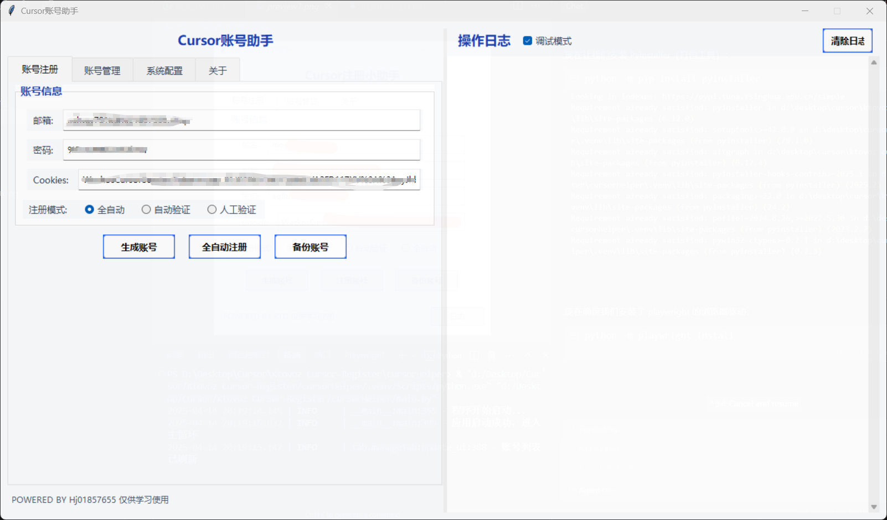
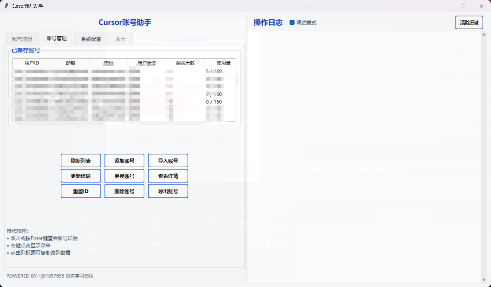
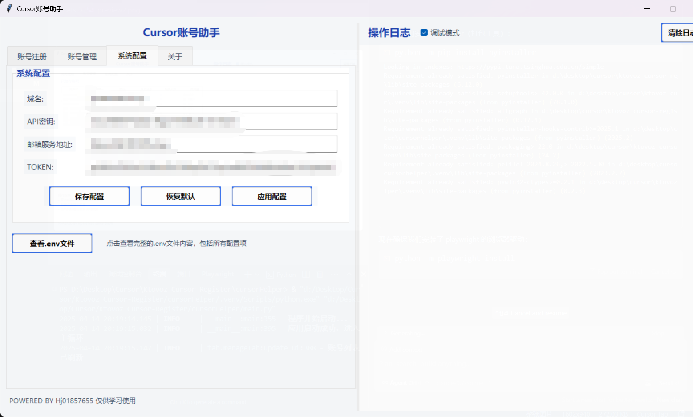
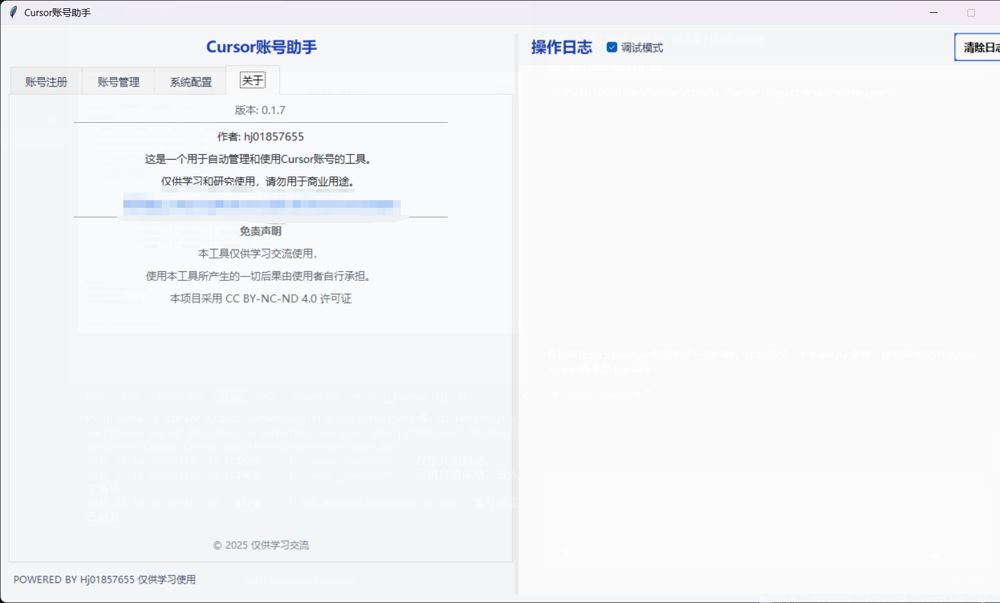

# 🎯 Cursor 注册助手

<div align="center">

[🌍 English Version](./README_EN.md) | [🇨🇳 中文版](./README.md)

> 🚀 一个帮助你轻松使用 Cursor 的小工具，支持多种注册方式，操作简单便捷。
>
> 💫 让注册过程变得简单而优雅

<p align="center">


<br/>


<br/>
<a href="https://github.com/ktovoz/cursorRegister/issues"></a>
<a href="https://github.com/ktovoz/cursorRegister/network"></a>
</p>

</div>

<p align="center">
  <b>
  <a href="#-快速开始">快速开始</a> •
  <a href="#-下载安装">下载安装</a> •
  <a href="#-使用方法">使用方法</a> •
  <a href="#-开发路线图">开发路线图</a> •
  <a href="#-注册方式">注册方式</a> •
  <a href="#-贡献指南">贡献指南</a> •
  <a href="#-常见问题">常见问题</a> •
  <a href="#-微信交流群">微信交流群</a> •
  <a href="#详细教程-">详细教程</a> •
  <a href="#-致谢">致谢</a>
  </b>
</p>

---

<div align="center">

```shell
🎉 让 Cursor 注册变得简单而优雅 
```

</div>

---

<div align="center">

## 📸 软件预览

</div>

<div align="center">

</div>

<div align="center">

</div>

<div align="center">

</div>

<div align="center">

</div>
---

<div align="center">

## ⚡ 快速开始

</div>

### 🌟 核心特性

- 🚀 全自动化注册流程
- 📧 多样化邮箱配置方案
- 🔒 安全可靠的账号管理
- 🎨 简洁优雅的操作界面
- 🔄 智能的自动更新保护
- 🌐 多平台兼容支持
- ⚙️ 灵活的配置选项

### 📋 系统要求

- 💻 Windows 系统
- 🎯 Cursor v0.44.11
- 🐍 Python 3.7+
- 🌐 稳定的网络连接
- 📮 可用的邮箱服务

<div align="center">

## 📥 下载安装

</div>

<details>
<summary><b>🖥️ Cursor 编辑器</b></summary>

### Windows 版本 (v0.44.11)

- 🔗 [官方下载](https://downloader.cursor.sh/builds/250103fqxdt5u9z/windows/nsis/x64)
-
🔄 [备用下载](https://download.todesktop.com/230313mzl4w4u92/Cursor%20Setup%200.44.11%20-%20Build%20250103fqxdt5u9z-x64.exe)

</details>

<details>
<summary><b>🛠️ 注册助手</b></summary>

- 📦 [从 Release 页面下载](https://github.com/ktovoz/cursorRegister/releases)

> 💡 请下载最新版本以获得最佳体验

</details>

<div align="center">

## 🗺️ 开发路线图

</div>

### 🎯 当前目标

- 🚀 优化自动注册流程的成功率
- 🤖 使用github action 进行自动注册
- 🎨 改进用户界面体验
- 📝 完善使用文档

### ✅ 已实现功能

- 💫 全自动注册流程
- 🔒 无感刷新cookie登录软件账号
- 📧 半自动，全自动，手动多种注册方式
- 💰 查询试用额度
- 🎯 辅助注册
- 🔄 重置机器ID
- 🎨 简洁的操作界面
- 📦 支持一键打包发布
- 💾 账号备份功能
- 🔄 批量账号管理
- 🔁 支持使用长期令牌切换账号

> 💡 路线图会根据社区反馈和实际需求动态调整

<div align="center">

## 🎯 使用方法

</div>

### 📹 使用教学视频

<div align="center">
  <a href="https://www.bilibili.com/video/BV1jhwZeRE2L/">
    
  </a>
</div>

### 🔰 前期准备

#### 📧 邮箱配置（二选一）

<table>
<tr>
<th>方案类型</th>
<th>配置步骤</th>
<th>优势</th>
</tr>
<tr>
<td>

**📨 临时邮箱**
*(简单快捷)*

</td>
<td>

1. 访问临时邮箱服务
2. 获取临时邮箱地址
3. 确保可接收验证邮件

</td>
<td>

- ⚡ 即开即用
- 🆓 完全免费
- 🔄 随用随换

</td>
</tr>
<tr>
<td>

**🌐 自有域名**
*(推荐方案)*

</td>
<td>

1. 准备一个域名
2. Cloudflare 配置：
    - DNS 记录设置
    - 邮箱转发规则

</td>
<td>

- 🔒 更高安全性
- ♾️ 永久可用
- 🎛️ 完全控制

</td>
</tr>
</table>

<div align="center">

## 🎯 注册方式

</div>

### 🌈 支持的注册方式

### 1️⃣ 全自动注册

推荐新手使用

<details>
<summary><b>📝 详细步骤</b></summary>

1. 获取必要信息：
    - 从 [moemail](https://github.com/beilunyang/moemail) 获取 API KEY
    - 获取可用 DOMAIN
2. 配置 .env 文件：
   ```
   API_KEY=你的API密钥
   DOMAIN=你的域名
   ```
3. 开始注册：
    - 勾选"全自动注册"
    - 点击"自动注册"
    - 等待完成

</details>

### 2️⃣ 手动注册

支持多种邮箱方案

<details>
<summary><b>📝 详细步骤</b></summary>

1. 选择邮箱方案：

   **方案A：临时邮箱**
    - 访问临时邮箱服务网站
    - 获取一个临时邮箱地址
    - ⚡ 优点：快速便捷
    - ⚠️ 缺点：可能被屏蔽

   **方案B：自有域名**
    - 准备一个域名
    - 配置 DNS 记录
    - 设置邮箱转发规则
    - 🔒 优点：稳定可靠
    - ⚙️ 缺点：需要配置

2. 开始注册流程：
    - 打开注册助手
    - 填写域名
    - 生成随机邮箱和密码
    - 选择验证方式
    - 点击"自动注册"

3. 选择验证方式：
    - 🤖 自动验证：软件自动通过人机验证
    - 👨‍💻 人工验证：手动通过人机验证
   > 💡 提示：两种方式都需要自己输入邮箱验证码

4. 完成验证：
    - 等待接收验证码
    - 根据选择的验证方式完成验证
    - 等待注册完成

5. 保存账号信息

</details>

### 3️⃣ GitHub Action

⚠️ 研发中

<details>
<summary><b>📝 详细步骤</b></summary>

1. Fork 本项目到你的 GitHub 账号
2. 从 [moemail](https://github.com/beilunyang/moemail) 项目获取 API KEY
3. 配置 GitHub Secrets：
    - 进入项目设置 -> Secrets and variables -> Actions
    - 添加名为 `API_KEY` 的 secret，值为获取到的 API KEY
    - 添加名为 `MOE_MAIL_URL` 的 secret，值为 moemail 服务的 URL
4. 触发注册流程：
    - 进入 Actions 标签页
    - 选择 `注册账号` workflow
    - 点击 "Run workflow"
    - 在弹出的对话框中输入 `DOMAIN` 值
5. 使用生成的账号：
    - 从 Artifacts 下载账号信息
    - 打开注册助手程序填入信息
    - 点击"刷新cookie"完成配置

> ⚠️ 注意事项：
> - 建议自行部署 moemail 服务以确保稳定性
> - 及时从 Artifacts 下载并删除账号信息
> - 妥善保管生成的 token

</details>

### ⭐ 使用建议

<details>
<summary><b>📝 如何选择？</b></summary>

#### 🔰 新手推荐

- 选择全自动注册
- 方便快捷，一键完成
- ⚠️ 需要配置部署moemail邮箱

#### 🎯 稳定需求

- 选择手动注册
- 最为稳定可靠
- 无需额外配置

#### 🔄 批量需求

- 等待 GitHub Action 功能
- 可以实现自动化批量注册

</details>

<div align="center">

## 🤝 贡献指南

</div>

### 🌟 如何贡献

我们非常欢迎并感谢所有形式的贡献！以下是一些参与项目的方式：

- 🐛 提交 Bug 报告
- 💡 提出新功能建议
- 📝 改进文档内容
- ⚙️ 提供代码贡献
- 🌍 帮助翻译文档
- 💬 回答其他用户问题

### 📋 贡献步骤

1. Fork 本仓库
2. 创建您的特性分支 (`git checkout -b feature/AmazingFeature`)
3. 提交您的更改 (`git commit -m 'Add some AmazingFeature'`)
4. 推送到分支 (`git push origin feature/AmazingFeature`)
5. 打开一个 Pull Request

> 💡 **欢迎提交 PR！** 如果您有任何改进想法，我们非常期待您的贡献。

<div align="center">

## 🎯 常见问题

</div>

<details>
<summary><b>💡 临时邮箱 vs 自有域名？</b></summary>

|   方式    |   优点    |    缺点    |
|:-------:|:-------:|:--------:|
| 📨 临时邮箱 | ⚡ 快速便捷  | ⚠️ 可能被屏蔽 |
| 🌐 自有域名 | 🔒 稳定可靠 | ⚙️ 需要配置  |

</details>

<details>
<summary><b>🔧 注册失败解决方案</b></summary>

- 🔄 尝试不同的临时邮箱服务
- 🌐 切换到自有域名方式
- 📡 检查网络连接

</details>

<details>
<summary><b>🍪 手动获取 Cookie</b></summary>

1. 🔍 打开浏览器开发者工具（F12）
2. 🌐 访问 cursor.sh 并登录
3. 🔎 在 Network 中找到 Cookie
4. 📋 复制并更新到程序中

</details>

<details>
<summary><b>🔄 如何切换账号</b></summary>

1. 在账号列表中选择一个账号
2. 确保该账号已获取长期令牌（TOKEN）
   - 如果没有长期令牌，先点击"更新信息"以获取长期令牌
3. 点击"切换账号"按钮
4. 等待系统处理，完成后会显示成功提示
5. 现在 Cursor 应用将使用所选账号的身份

> 💡 切换账号功能使用长期令牌，可以无需重新登录即可切换 Cursor 账号，非常方便。

</details>

<div align="center">

## 🤝 微信交流群

</div>

<div align="center">
<table>
<tr>
<td align="center">

<p>该二维码7天内（4月21日前）有效，重新进入将更新</p>
</td>
<td>

### 🌟 加入微信群

- 📱 扫描左侧二维码加入微信群
- 💬 与其他用户交流使用心得
- ❓ 解决使用过程中的问题
- 获取最新版本和更新信息

#### 扫描左侧二维码，立即加入微信群！

</td>
</tr>
</table>
</div>

<div align="center">

## 详细教程 📖

</div>

访问 [Cursor 注册助手食用指南](https://www.ktovoz.com/blog/%E6%95%99%E5%AD%A6/Cursor%E6%B3%A8%E5%86%8C%E5%8A%A9%E6%89%8B%E9%A3%9F%E7%94%A8%E6%8C%87%E5%8D%97)
获取完整教程。

<div align="center">

## 🌟 致谢

</div>

### 👥 项目贡献者

感谢所有让这个项目变得更好的贡献者！

<div align="center">
<a href="https://github.com/hj01857655/cursorHelper/graphs/contributors">
  
</a>
</div>

<div align="center">
<table>
<tr>
<td align="center">
<a href="https://github.com/hj01857655">
<br/>
<sub><b>hj01857655</b></sub><br/>
<sub><a href="https://github.com/hj01857655/cursorHelper">cursorHelper</a></sub><br/>
</a>
</td>
</tr>
</table>
</div>

### 🏆 特别鸣谢

特别感谢以下开源项目及其作者为本项目提供灵感和参考：

<div align="center">
<table>
<tr>
<td align="center">
<a href="https://github.com/Ktovoz">
<br/>
<sub><b>Ktovoz</b></sub><br/>
<sub><a href="https://github.com/Ktovoz/cursorRegister">cursorRegister</a></sub><br/>
</a>
</td>
<td align="center">
<a href="https://github.com/chengazhen">
<br/>
<sub><b>chengazhen</b></sub><br/>
<sub><a href="https://github.com/chengazhen/cursor-auto-free">cursor-auto-free</a></sub><br/>
</a>
</td>
<td align="center">
<a href="https://github.com/yuaotian">
<br/>
<sub><b>yuaotian</b></sub><br/>
<sub><a href="https://github.com/yuaotian/go-cursor-help">go-cursor-help</a></sub><br/>
</a>
</td>
<td align="center">
<a href="https://github.com/JiuZ-Chn">
<br/>
<sub><b>JiuZ-Chn</b></sub><br/>
<sub><a href="https://github.com/JiuZ-Chn/CursorRegister">CursorRegister</a></sub><br/>
</a>
</td>
<td align="center">
<a href="https://github.com/beilunyang">
<br/>
<sub><b>beilunyang</b></sub><br/>
<sub><a href="https://github.com/beilunyang/moemail">moemail</a></sub><br/>
</a>
</td>
</tr>
<tr>
<td align="center">
<a href="https://github.com/JiuZ-Chn">
<br/>
<sub><b>JiuZ-Chn</b></sub><br/>
<sub><a href="https://github.com/JiuZ-Chn/Cursor-To-OpenAI">Cursor-To-OpenAI</a></sub><br/>
</a>
</td>
</tr>
</table>
</div>

<div align="center">

## 📜 许可证与声明

</div>

### 📋 许可说明

本项目采用 [CC BY-NC-ND 4.0](https://creativecommons.org/licenses/by-nc-nd/4.0/) 许可证

#### ✅ 您可以：

- 📤 分享 — 在任何媒介以任何形式复制、发行本作品

#### ❌ 但是不能：

- 💰 商业使用
- ✏️ 修改原作品
- 🔄 二次分发

### ⚠️ 免责声明

- 📚 仅供学习交流
- 🚫 禁止商业用途
- ⚖️ 使用后果自负
- 🔒 作者不承担责任

---

<div align="center">

**[⬆ 返回顶部](#-cursorhelper)**

<br/>

<sub>用 ❤️ 制作 | Copyright © 2025 hj01857655</sub>

</div>